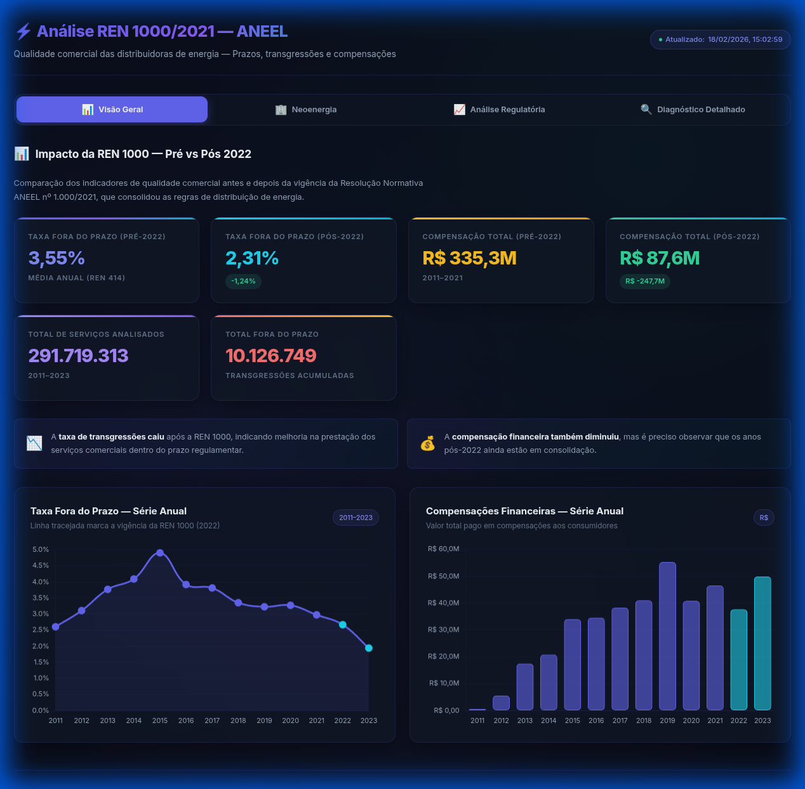
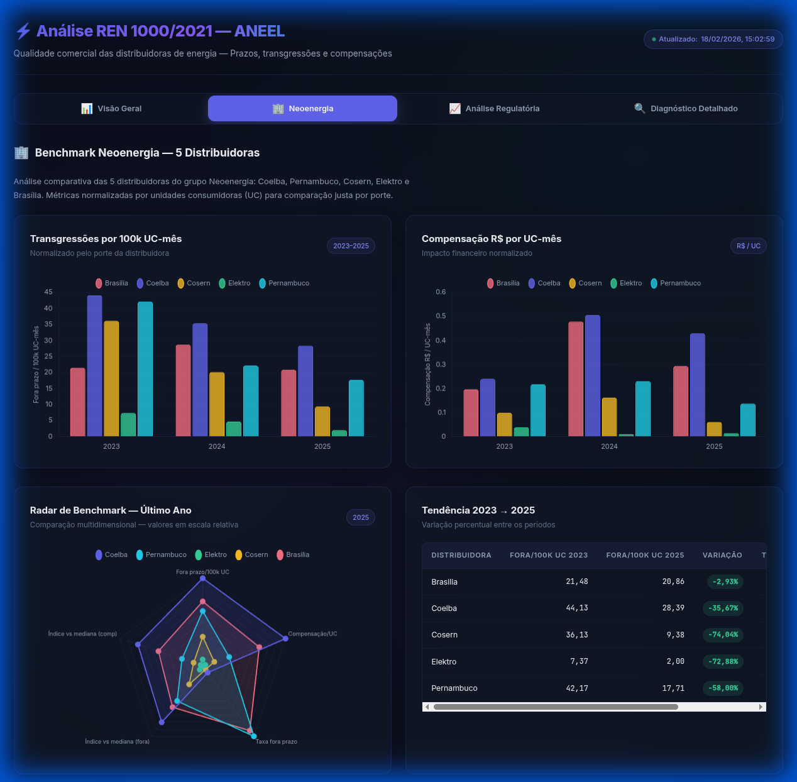
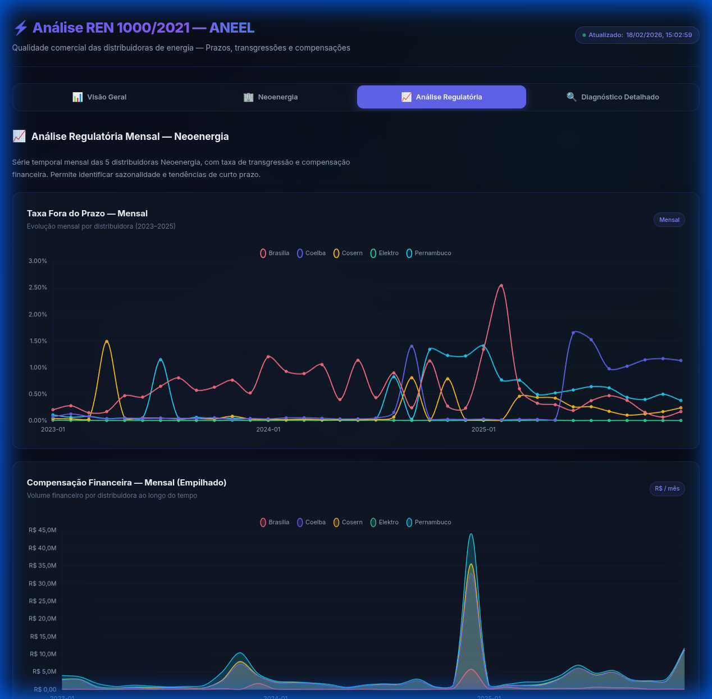
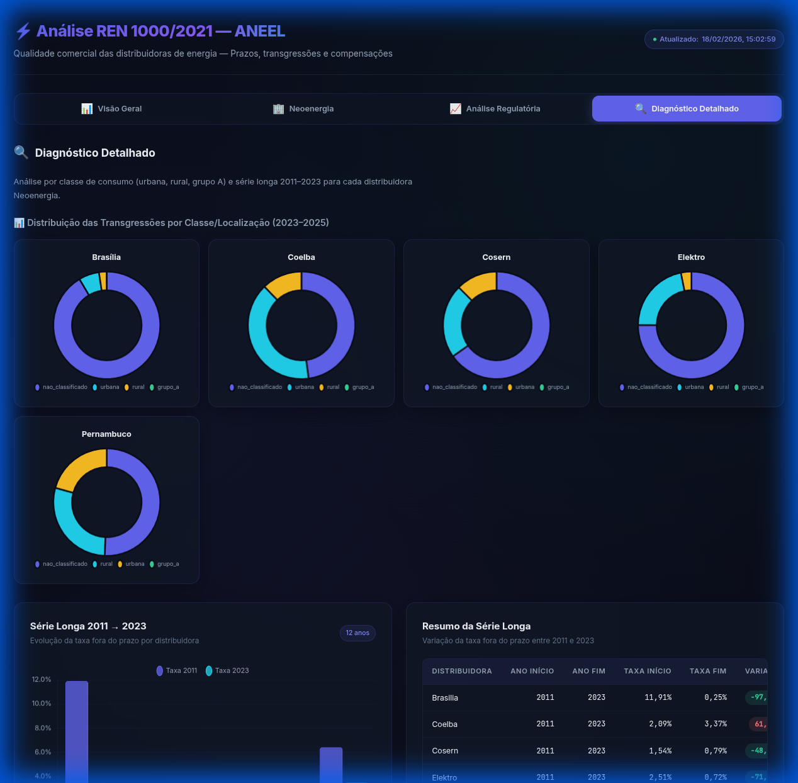

# ⚡ TCC — Análise de Eficácia da REN 1000/2021 (ANEEL)

**Tema:** Avaliação do impacto da Resolução Normativa ANEEL nº 1.000/2021 na qualidade comercial das distribuidoras de energia elétrica do Brasil.

**Foco:** Prazos de serviços comerciais, transgressões (fora do prazo) e compensações financeiras (R$) — **não** DEC/FEC.

---

## 📊 Dashboard Interativo

O projeto conta com um **dashboard web interativo** para visualização dos resultados, com design dark mode e gráficos Chart.js.

```bash
# Para visualizar o dashboard:
make serve
# Acesse http://localhost:8000
```

### Visão Geral — Impacto Pré vs Pós REN 1000

KPIs comparando os períodos regulatórios, séries temporais de taxa fora do prazo (2011–2023) e evolução das compensações financeiras:



### Benchmark Neoenergia — 5 Distribuidoras

Análise comparativa normalizada por 100k UC-mês entre Brasília, Coelba, Cosern, Elektro e Pernambuco, com radar multidimensional e tabela de tendência:



### Análise Regulatória — Série Mensal

Acompanhamento mensal da taxa de transgressão e compensações financeiras empilhadas por distribuidora (2023–2025):



### Diagnóstico Detalhado

Distribuição por classe/localização (donut charts) e evolução da série longa 2011–2023 por distribuidora:



> 📖 Documentação técnica completa (como alterar gráficos, arquitetura, dependências):
>
> 👉 [`dashboard/README.md`](dashboard/README.md)

---

## 📂 Estrutura do Projeto

```text
├── data/
│   ├── raw/              ← CSVs brutos baixados da ANEEL (não vai pro Git)
│   ├── processed/        ← Dados limpos em Parquet/CSV + camada analítica
│   └── docs/             ← Dicionários de dados e manuais (PDFs)
│
├── src/
│   ├── etl/
│   │   ├── extract_aneel.py    ← Baixa os dados do portal Dados Abertos
│   │   └── transform_aneel.py  ← Limpa e salva em Parquet/CSV
│   └── analysis/               ← Análises, benchmark e geração de dados
│
├── dashboard/            ← Dashboard interativo + relatório imprimível
│   ├── index.html        ← SPA com 4 abas (Chart.js + dark mode)
│   ├── app.js            ← Lógica de gráficos e navegação
│   ├── styles.css        ← Design system (CSS puro)
│   ├── relatorio.html    ← Relatório otimizado para PDF
│   └── README.md         ← Documentação técnica do dashboard
│
├── reports/              ← Relatórios gerados em Markdown
├── notebooks/            ← Notebooks de exploração analítica
├── docs/                 ← Guias, imagens e documentação
├── _archive/             ← Arquivos da versão anterior do projeto
├── requirements.txt      ← Bibliotecas Python necessárias
└── COMO_USAR_GIT.md      ← Guia rápido de Git
```

---

## ✅ Estado Atual dos Dados

- **Qualidade Comercial:** 2011–2025 (com 2024/2025 ainda incompletos para inferência de tendência).
- **INDGER Serviços Comerciais:** 2023–2025 (nível detalhado mensal/municipal).
- **INDGER Dados Comerciais:** 2023–2025 (usado para porte por UC ativa).
- **Valor pago/compensação:** disponível localmente nas bases:
  - `vlrpagocompensacao` (INDGER serviços)
  - indicadores `CR*` (Qualidade Comercial)

---

## 🛠️ Configurando o Ambiente

```bash
# 1. Crie o ambiente virtual
python3 -m venv .venv

# 2. Ative o ambiente
source .venv/bin/activate        # Linux/Mac
# .venv\Scripts\activate         # Windows

# 3. Instale as dependências
pip install -r requirements.txt
```

---

## 🚀 Como Usar (Pipeline Completo)

Execute na ordem ou use `make pipeline` para rodar tudo:

```bash
# Passo 1: Baixar dados reais da ANEEL
python -m src.etl.extract_aneel

# Passo 2: Limpar e transformar os dados
python -m src.etl.transform_aneel

# Passo 3: Gerar tabelas analíticas (inclui normalização por porte)
python -m src.analysis.build_analysis_tables

# Passo 4: Gerar relatório consolidado
python -m src.analysis.build_report

# Passo 5: Gerar dados do dashboard
python -m src.analysis.build_dashboard_data
```

---

## ⚙️ Atalhos com Makefile

```bash
make help                       # lista todos os targets
make update-data                # extract + transform
make analysis                   # gera tabelas analíticas
make report                     # gera relatório markdown
make neoenergia-diagnostico     # benchmark detalhado das 5 Neoenergias
make dashboard                  # gera JSON + instruções para abrir
make serve                      # servidor local em http://localhost:8000
make pipeline                   # tudo: ETL → análise → relatório → dashboard
make test-fast                  # testes rápidos
make test-smoke                 # smoke test
```

---

## 📈 Saídas de Análise

Após rodar o pipeline, o projeto gera:

### Tabelas analíticas (`data/processed/analysis/`)

| Arquivo | Nível | Uso principal |
|---|---|---|
| `dim_indicador_servico` | dimensão | Mapeia indicador para serviço/classe/localidade e artigo regulatório |
| `dim_distribuidora_porte` | distribuidora-ano | Porte por UC ativa média mensal + bucket/rank anual |
| `fato_uc_ativa_mensal_distribuidora` | distribuidora-mês | UC ativa mensal para normalização |
| `fato_indicadores_anuais` | distribuidora-ano-serviço | Série longa (QS, QV, PM, CR), pré/pós 2022 |
| `fato_servicos_municipio_mes` | distribuidora-mês-município-serviço | Drill-down detalhado para investigação |
| `fato_transgressao_mensal_porte` | distribuidora-mês-classe | Mensal com transgressão e compensação normalizadas por porte |
| `fato_transgressao_mensal_distribuidora` | distribuidora-mês | Versão enxuta para acompanhamento recorrente |
| `kpi_regulatorio_anual` | ano | Resumo anual consolidado para narrativa do TCC |

### Diagnóstico Neoenergia (`data/processed/analysis/neoenergia/`)

- `neo_mensal_2023_2025.csv` — acompanhamento mensal
- `neo_anual_2023_2025.csv` — consolidação anual
- `neo_tendencia_2023_2025.csv` — análise de tendência
- `neo_alertas_comparabilidade.csv` — alertas de comparabilidade

### Relatórios

- `reports/relatorio_aneel.md` — relatório consolidado geral
- `reports/neoenergia_diagnostico.md` — diagnóstico das 5 Neoenergias

### Dashboard e Relatório Visual

- `dashboard/index.html` — **dashboard interativo** (Chart.js, 4 abas)
- `dashboard/relatorio.html` — **relatório imprimível** (Ctrl+P → PDF)
- `dashboard/dashboard_data.json` — dados JSON (gerado automaticamente)

### Notebooks de apoio

- `notebooks/01_mapa_dados_e_qualidade.ipynb`
- `notebooks/02_tendencia_regulatoria_414_vs_1000.ipynb`
- `notebooks/03_porte_e_benchmark_distribuidoras.ipynb`

---

## ❓ Como Responder as Perguntas do TCC

1. **"Ficou menos fora do prazo?"**
   Use `kpi_regulatorio_anual` e `fato_indicadores_anuais` (`taxa_fora_prazo`).

2. **"As compensações aumentaram?"**
   Use `compensacao_rs` em `kpi_regulatorio_anual` e `fato_transgressao_mensal_distribuidora`.

3. **"Comparação justa por tamanho da distribuidora?"**
   Use `fora_prazo_por_100k_uc_mes` e `compensacao_rs_por_uc_mes` em `fato_transgressao_mensal_distribuidora`.

4. **"Grupo A/B e rural/urbana?"**
   Use `classe_local` em `fato_indicadores_anuais` e `classe_local_servico` em `fato_transgressao_mensal_porte`.

---

## 🔄 Rotina Recomendada de Trabalho

### Atualização mensal (quando ANEEL publicar novo mês)

```bash
make pipeline
# ou passo a passo:
python -m src.etl.extract_aneel
python -m src.etl.transform_aneel
python -m src.analysis.build_analysis_tables
python -m src.analysis.build_report
python -m src.analysis.build_dashboard_data
```

### Exploração e escrita analítica

1. Validar cobertura e qualidade: `notebooks/01_mapa_dados_e_qualidade.ipynb`
2. Atualizar tendência regulatória: `notebooks/02_tendencia_regulatoria_414_vs_1000.ipynb`
3. Atualizar benchmark por porte: `notebooks/03_porte_e_benchmark_distribuidoras.ipynb`
4. Consolidar texto final em `reports/relatorio_aneel.md`

---

## 🎯 Próximos Passos

1. Congelar uma janela comparável para inferência (ex.: 2011–2023).
2. Rodar análise de sensibilidade (absoluto vs normalizado por UC ativa).
3. Fechar capítulo metodológico com definição explícita das métricas.
4. Exportar tabelas finais do TCC a partir de `data/processed/analysis`.
5. Criar versão final dos gráficos para o texto da monografia.

---

## 📘 Documentação Adicional

| Documento | Conteúdo |
|---|---|
| [`docs/GUIA_ANALISE.md`](docs/GUIA_ANALISE.md) | Guia operacional detalhado (métricas, exemplos, checklist) |
| [`docs/PROXIMOS_PASSOS_TCC.md`](docs/PROXIMOS_PASSOS_TCC.md) | Roadmap de execução até a versão final |
| [`dashboard/README.md`](dashboard/README.md) | Documentação técnica do dashboard (tecnologias, como alterar, arquitetura) |
| [`COMO_USAR_GIT.md`](COMO_USAR_GIT.md) | Guia rápido de Git para trabalho em equipe |

---

## 📊 Fontes de Dados

| Fonte | Conteúdo | Formato |
|---|---|---|
| **Qualidade do Atendimento Comercial** | Prazos, transgressões, compensações R$ | CSV |
| **INDGER — Serviços Comerciais** | Quantidades, prazos, estoques, compensações | ZIP/CSV |
| **INDGER — Dados Comerciais** | Faturamento, danos elétricos, atendimento | CSV |

Todos disponíveis em: [dadosabertos.aneel.gov.br](https://dadosabertos.aneel.gov.br)

## 🎯 Variáveis de Interesse

- **Eficácia:** Serviços realizados dentro do prazo regulamentar
- **Transgressões:** Serviços fora do prazo (Anexo IV da REN 1000)
- **Compensações:** Valores financeiros (R$) creditados ao consumidor
- **Segmentação:** Por distribuidora, estado, grupo tarifário (A/B), zona (rural/urbana)
- **Temporal:** Antes × depois da vigência da REN 1000

## 📚 Contexto Normativo

- **REN ANEEL nº 1.000/2021:** Consolida as regras de distribuição de energia
- **Anexo IV:** Define prazos máximos para prestação de serviços comerciais
- **PRODIST (Módulo 8, Seção 8.3):** Detalhamento dos procedimentos
