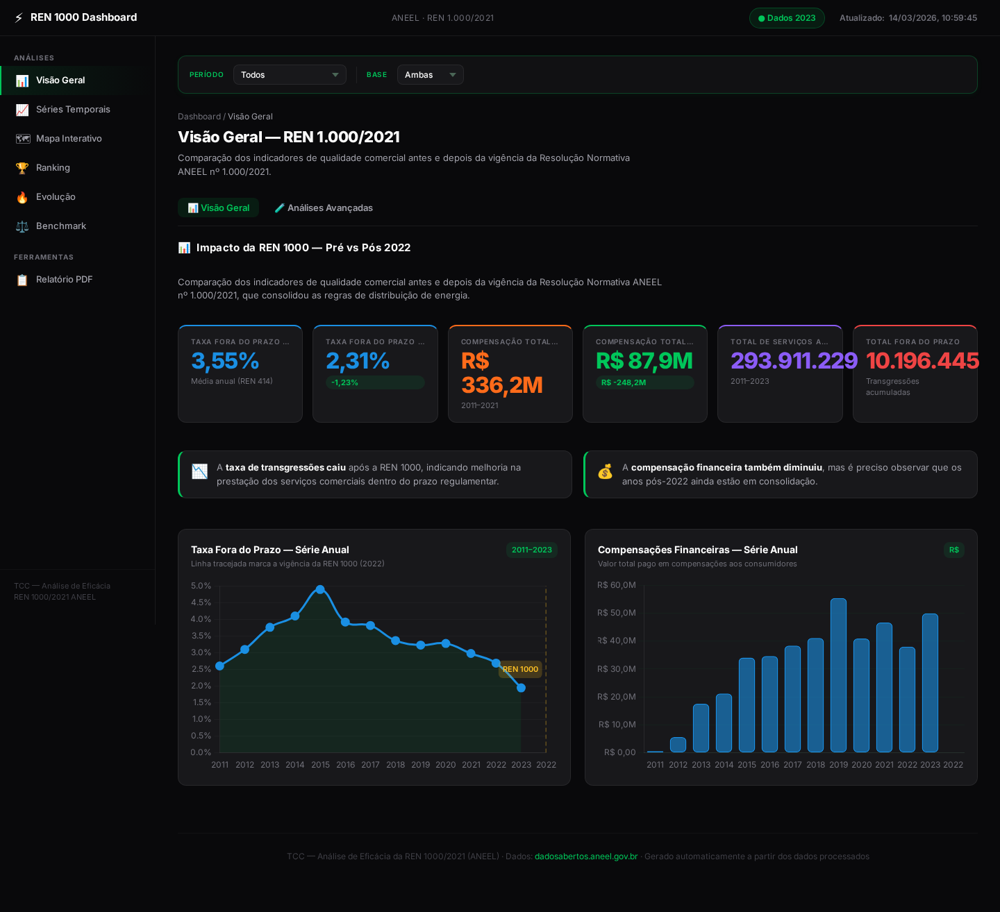
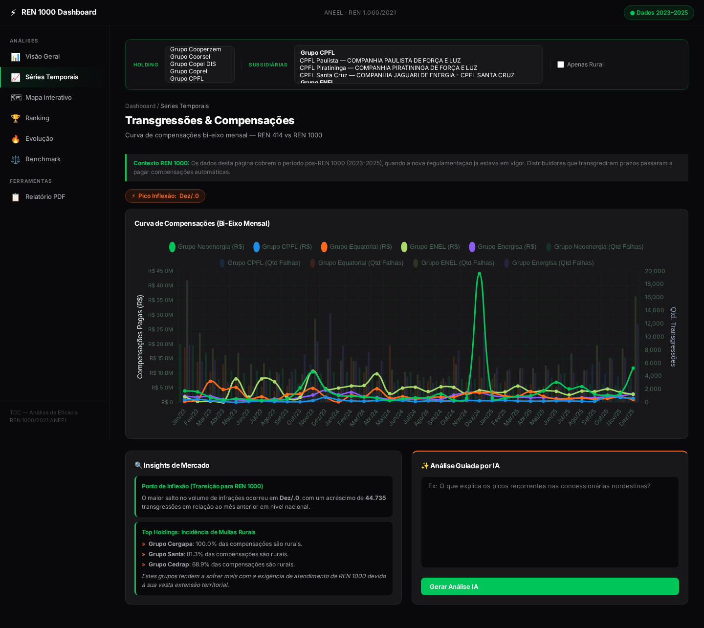
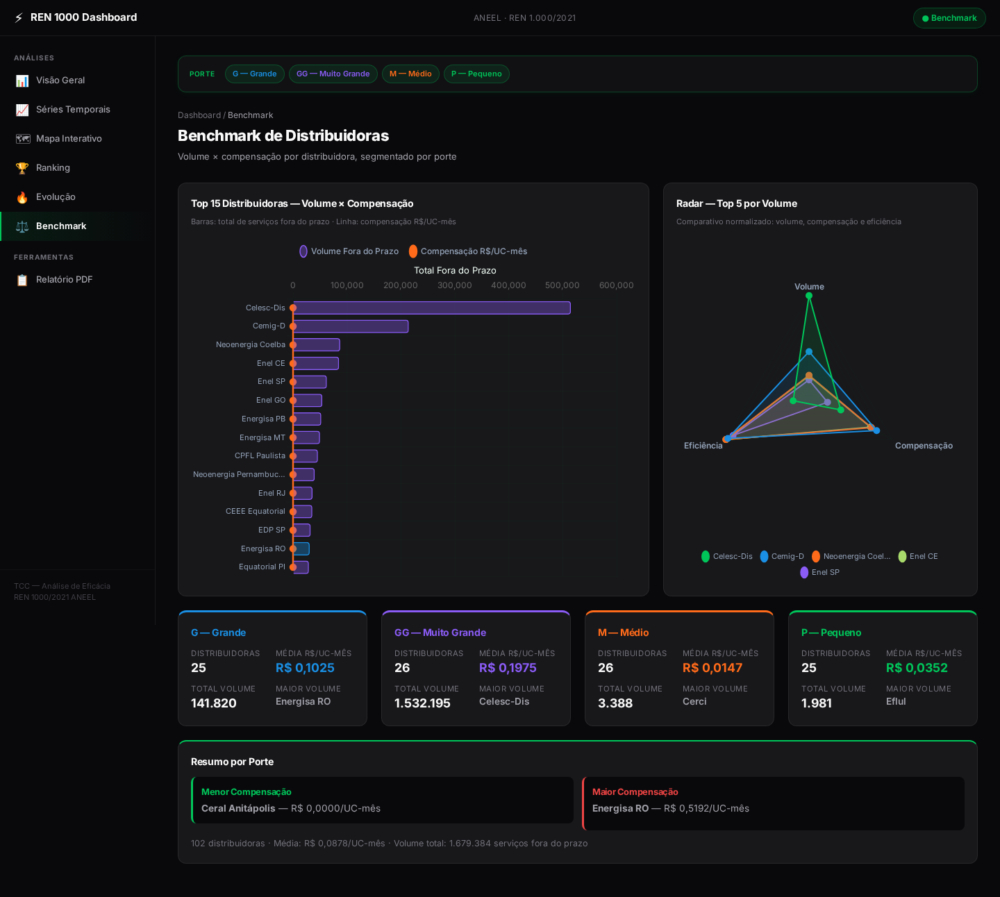
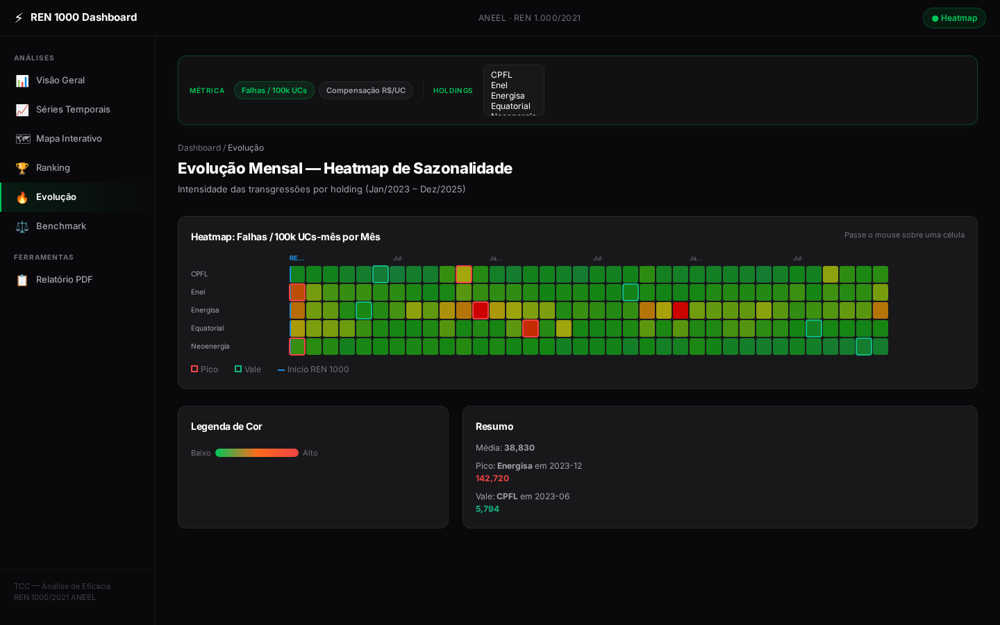
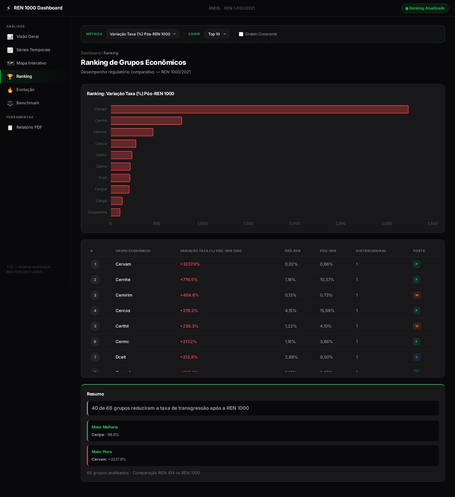
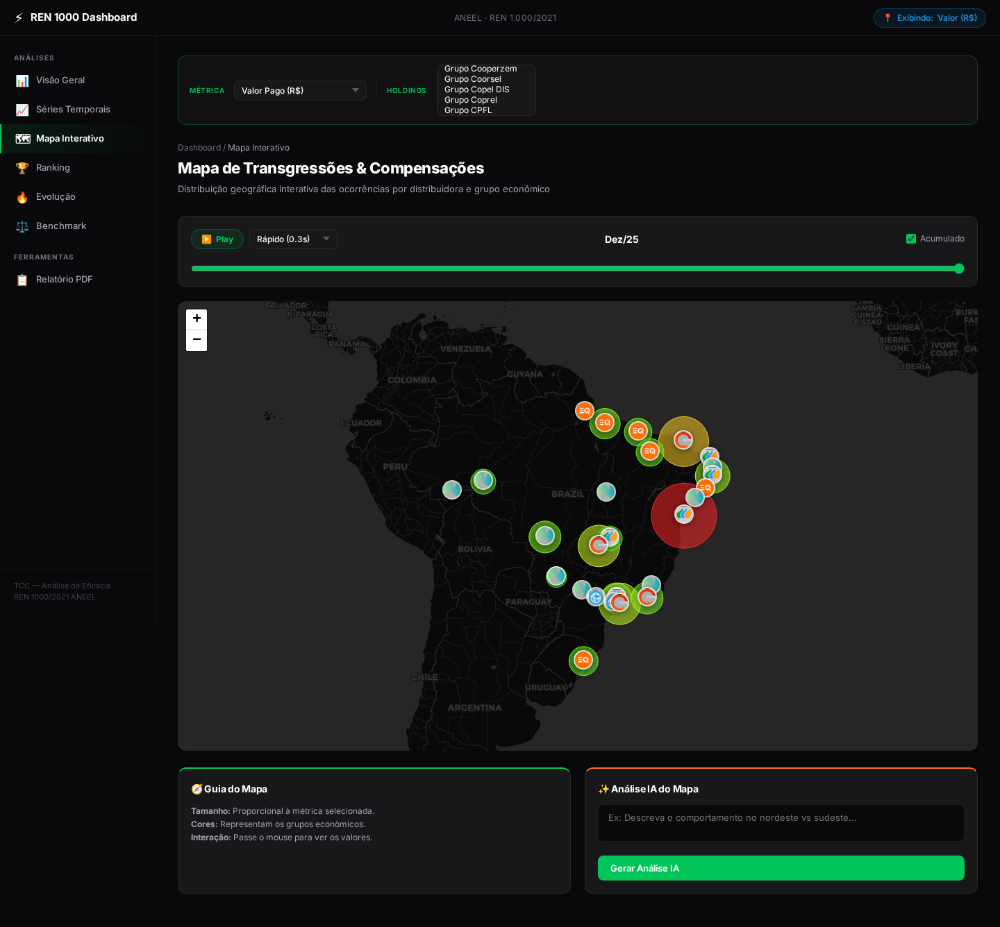

# ⚡ TCC — Análise de Eficácia da REN 1000/2021 (ANEEL)

**Tema:** Avaliação do impacto da Resolução Normativa ANEEL nº 1.000/2021 na qualidade comercial das distribuidoras de energia elétrica do Brasil.

**Foco:** Prazos de serviços comerciais, transgressões (fora do prazo) e compensações financeiras (R$) — **não** DEC/FEC.

---

> **🤖 Nota para Agentes de IA:** Sempre inicie analisando commits recentes (`git log -n 5 --stat`), lendo gradualmente arquivos correlatos, e invariavelmente atualizando este `README.md` e o `AGENTS.md` com as últimas melhorias. Para comandos e arquitetura técnica, veja `CLAUDE.md`. Para contexto de IA, veja `.ai/CONTEXT.md`.

## 📊 Dashboard Interativo

O projeto conta com um **dashboard web interativo** com 6 páginas, design dark mode e gráficos Chart.js/Leaflet.

```bash
# Para visualizar o dashboard:
make serve
# Acesse http://localhost:8051
```

```bash
# Para usar backend local (API + arquivos estáticos):
make dev-serve
# Health: http://localhost:8051/health
# API:    http://localhost:8051/api/dashboard
```

### Visão Geral — KPIs e Tendências (`index.html`)

KPIs comparando os períodos regulatórios (pré/pós REN 1000), série anual de taxa fora do prazo (2011–2023) e visão consolidada por grupos econômicos:



### Transgressões — Séries Temporais (`transgressoes.html`)

Gráfico bi-eixo com volume de transgressões e compensações financeiras mensais por distribuidora, com filtros por holding e período:



### Benchmark — Volume × Compensação (`benchmark.html`)

Scatter plot interativo: volume de serviços versus compensação financeira por porte de distribuidora (normalizado por 100k UC-mês):



### Evolução — Heatmap Mensal por Holding (`evolucao.html`)

Heatmap de sazonalidade mensal da taxa de transgressão por holding/grupo econômico (2023–2025):



### Ranking — Grupos Econômicos por Métrica (`ranking.html`)

Ranking horizontal de grupos econômicos por métrica selecionável (taxa de transgressão, compensação R$/UC-mês, volume):



### Mapa Geográfico Interativo (`mapa.html`)

Mapa choropleth Leaflet com distribuidoras por estado, colorido por taxa de transgressão ou compensação financeira:



> 📖 Documentação técnica completa (como alterar gráficos, arquitetura, módulos compartilhados):
>
> 👉 [`app/frontend/README.md`](app/frontend/README.md)

---

## 📂 Estrutura do Projeto

```text
├── data/
│   ├── raw/              ← CSVs brutos baixados da ANEEL (não vai pro Git)
│   ├── processed/        ← Dados limpos em Parquet/CSV + camada analítica
│   └── docs/             ← Dicionários de dados e manuais (PDFs)
│
├── src/
│   ├── etl/
│   │   ├── extract_aneel.py    ← Baixa os dados do portal Dados Abertos
│   │   └── transform_aneel.py  ← Limpa e salva em Parquet/CSV
│   └── analysis/               ← Análises, benchmark e geração de dados
│
├── app/
│   ├── frontend/         ← Dashboard SPA (6 páginas + módulos compartilhados)
│   │   ├── index.html         ← Visão geral (KPIs, tendências, grupos)
│   │   ├── transgressoes.html ← Séries temporais de transgressão
│   │   ├── benchmark.html     ← Bubble chart: volume × compensação
│   │   ├── evolucao.html      ← Heatmap mensal por holding
│   │   ├── ranking.html       ← Ranking horizontal por métrica
│   │   ├── mapa.html          ← Mapa geográfico interativo
│   │   ├── relatorio.html     ← Relatório otimizado para PDF (Ctrl+P)
│   │   ├── styles.css         ← Design system dark mode (CSS puro)
│   │   ├── utils.js           ← Formatadores pt-BR (fmtNum, fmtMoney…)
│   │   ├── nav.js             ← Sidebar, mobile toggle, toast system
│   │   ├── filters.js         ← Estado global de filtros + evento filters:change
│   │   ├── app.js             ← Chart.js defaults, constantes compartilhadas
│   │   └── README.md          ← Documentação técnica do frontend
│   └── backend/
│       └── main.py       ← FastAPI: API REST + serving de estáticos
│
├── reports/              ← Relatórios gerados em Markdown
├── notebooks/            ← Notebooks de exploração analítica
├── docs/                 ← Guias, imagens e documentação
├── logos/                ← Logos PNG das holdings (espelhados em app/frontend/assets/logos/)
├── _archive/             ← Arquivos da versão anterior do projeto
├── requirements.txt      ← Bibliotecas Python necessárias
└── COMO_USAR_GIT.md      ← Guia rápido de Git
```

---

## ✅ Estado Atual dos Dados

> **Os dados já passaram por etapas rigorosas de ETL, aderência de tipos e validação de qualidade.** Eles estão limpos, corretos, consolidados em Parquet/CSV na pasta `data/processed/analysis/` e prontos para consumo da aplicação.

- **Qualidade Comercial:** 2011–2025 (com 2024/2025 ainda incompletos para inferência de tendência).
- **INDGER Serviços Comerciais:** 2023–2025 (nível detalhado mensal/municipal).
- **INDGER Dados Comerciais:** 2023–2025 (usado para porte por UC ativa).
- **Valor pago/compensação:** disponível localmente nas bases:
  - `vlrpagocompensacao` (INDGER serviços)
  - indicadores `CR*` (Qualidade Comercial)

---

## 🛠️ Configurando o Ambiente

```bash
# Fluxo canonico de recuperacao do ambiente local:
make venv-recreate
make install
make doctor
make preflight-backend

# Subir backend/API + estatico:
make backend
# ou:
make serve

# Para testar analitico cruzado de Transgressões e Grupos Econômicos:
cd app/frontend && python3 -m http.server 8051
# Acesse http://localhost:8051/transgressoes.html
```

### 🐳 Docker (Dashboard e Orquestração)

**Dashboard (API + Estáticos)**:

```bash
# Docker e local dev usam a porta 8051 via make serve ou docker compose
docker compose up --build
```

- A porta pública do Docker e para desenvolvimento local é a `8051`. No Docker, essa porta é exportada e mapeada corretamente. Para desenvolvimento local, use `make serve` ou `make backend`.

**Apache Kestra (Orquestração de Dados + Gemini)**:
O repositório inclui a infraestrutura local em contêiner para orquestração analítica avançada:

```bash
docker compose -f docker/docker-compose.kestra.yml up -d
```

> **Nota**: Para que os fluxos com IA funcionem, inclua `GEMINI_API_KEY` em seu arquivo `.env`, o qual é lido pelo Kestra via `.env` map no compose e injetado nos containers de plugin do Kestra.

---

## 🚀 Como Usar (Pipeline Completo)

Execute na ordem ou use `make pipeline` para rodar tudo:

```bash
# Passo 1: Baixar dados reais da ANEEL
python3 -m src.etl.extract_aneel

# Passo 2: Limpar e transformar os dados
python3 -m src.etl.transform_aneel

# Passo 3: Gerar tabelas analíticas (inclui normalização por porte)
python3 -m src.analysis.build_analysis_tables

# Passo 4: Gerar relatório consolidado
python3 -m src.analysis.build_report

# Passo 5: Gerar dados do dashboard
python3 -m src.analysis.build_dashboard_data
```

### Comandos Auxiliares e Testes

Opcionalmente, o repositório conta com scripts de ferramentas e extração de dados geográficos complementares:

```bash
# Para extrair e processar os dados de municípios do IBGE:
make extract-ibge

# Para inspecionar e listar as tabelas e schemas disponíveis na camada 'processed':
make inspect-tables
```

---

## 🐘 Integração Relacional (PostgreSQL)

Para tirar carga de processamento na memória e dar suporte a análises avançadas (Window Functions, CTEs complexas), o projeto possui integração direta com PostgreSQL.

### Scripts Automáticos de Carga

Disponíveis na pasta `scripts/`:

- `load_to_postgres.py`: Carga relacional do pipeline completo.
- `load_chunked.py`: Carga em lote (chunks) com otimização de memória, ideal para grandes tabelas como `indger_servicos_comerciais`.
- `load_focused_tables.py`: Carga direcionada somente às tabelas necessárias para o benchmark Neoenergia.

### DBeaver & SQL Legado

Para as queries de diagnóstico e migração manual:

- `sql/grupos_diagnostico_dbeaver.sql`
- Ordem de execução, exportação CSV e limitações: veja o guia `docs/DBEAVER_SQL_MIGRATION.md`.

---

## ⚙️ Atalhos com Makefile

```bash
make help                       # lista todos os targets
make venv-recreate             # recria .venv do zero
make update-data                # extract + transform
make extract-ibge               # baixa/processa dados geográficos complementares do IBGE
make inspect-tables             # imprime colunas e schemas das bases .parquet geradas
make analysis                   # gera tabelas analíticas
make report                     # gera relatório markdown
make neoenergia-diagnostico     # benchmark detalhado das 5 Neoenergias
make dashboard                  # gera JSON + instruções para abrir
make dashboard-full             # analysis + neoenergia + dashboard
make serve                      # servidor local em http://localhost:${PORT} (default 8051)
make backend                    # backend FastAPI local em http://localhost:${PORT}
make dev-serve                  # dashboard-full + preflight + backend (--reload, PORT customizável, default 8051)
make doctor                     # valida .venv + imports criticos (numpy/pandas/fastapi/uvicorn)
make validate-contracts         # valida contratos de schema (raw + processed)
make check-artifacts-full       # valida artefatos completos + dashboard JSON
make pipeline                   # tudo: ETL → análise → relatório → neoenergia → dashboard
make test-fast                  # compilação + imports + contratos + artefatos core
make test-smoke                 # smoke completo (neoenergia + dashboard)
```

---

## 📈 Saídas de Análise

Após rodar o pipeline, o projeto gera:

### Tabelas analíticas (`data/processed/analysis/`)

| Arquivo | Nível | Uso principal |
|---|---|---|
| `dim_indicador_servico` | dimensão | Mapeia indicador para serviço/classe/localidade e artigo regulatório |
| `dim_distribuidora_porte` | distribuidora-ano | Porte por UC ativa média mensal + bucket/rank anual |
| `fato_uc_ativa_mensal_distribuidora` | distribuidora-mês | UC ativa mensal para normalização |
| `fato_indicadores_anuais` | distribuidora-ano-serviço | Série longa (QS, QV, PM, CR), pré/pós 2022 |
| `fato_servicos_municipio_mes` | distribuidora-mês-município-serviço | Drill-down detalhado para investigação |
| `fato_transgressao_mensal_porte` | distribuidora-mês-classe | Mensal com transgressão e compensação normalizadas por porte |
| `fato_transgressao_mensal_distribuidora` | distribuidora-mês | Versão enxuta para acompanhamento recorrente |
| `kpi_regulatorio_anual` | ano | Resumo anual consolidado para narrativa do TCC |

### Diagnóstico Neoenergia (`data/processed/analysis/neoenergia/`)

- `neo_mensal_2023_2025.csv` — acompanhamento mensal
- `neo_anual_2023_2025.csv` — consolidação anual
- `neo_tendencia_2023_2025.csv` — análise de tendência
- `neo_alertas_comparabilidade.csv` — alertas de comparabilidade

### Relatórios

- `reports/relatorio_aneel.md` — relatório consolidado geral
- `reports/neoenergia_diagnostico.md` — diagnóstico das 5 Neoenergias

### Apresentação (.pptx)

- `output/apresentacao_tcc_investigacao_dados_analises.pptx` — deck consolidado da investigação de dados e análises.
- Script reprodutível: `scripts/generate_tcc_investigacao_pptx.py`
- Como gerar novamente:

```bash
.venv/bin/python scripts/generate_tcc_investigacao_pptx.py
```

### Dashboard e Relatório Visual

- `app/frontend/index.html` — **dashboard interativo** (6 páginas com sidebar, Chart.js)
- `app/frontend/relatorio.html` — **relatório imprimível** (Ctrl+P → PDF)
- `app/frontend/dashboard_data.json` — payload principal, ~27 MB (gerado automaticamente)
- JSONs auxiliares: `dashboard_transgressoes.json`, `dashboard_timeseries.json`, `dashboard_scatter.json`, `dashboard_heatmap.json`, `dashboard_radar.json`, `dashboard_groups_ranking.json`

### Notebooks de apoio

- `notebooks/01_mapa_dados_e_qualidade.ipynb`
- `notebooks/02_tendencia_regulatoria_414_vs_1000.ipynb`
- `notebooks/03_porte_e_benchmark_distribuidoras.ipynb`
- `notebooks/04_exploracao_sql_avancada.ipynb`
- `notebooks/05_analise_5_maiores_grupos.ipynb`

---

## ❓ Como Responder as Perguntas do TCC

1. **"Ficou menos fora do prazo?"**
   Use `kpi_regulatorio_anual` e `fato_indicadores_anuais` (`taxa_fora_prazo`).

2. **"As compensações aumentaram?"**
   Use `compensacao_rs` em `kpi_regulatorio_anual` e `fato_transgressao_mensal_distribuidora`.

3. **"Comparação justa por tamanho da distribuidora?"**
   Use `fora_prazo_por_100k_uc_mes` e `compensacao_rs_por_uc_mes` em `fato_transgressao_mensal_distribuidora`.

4. **"Grupo A/B e rural/urbana?"**
   Use `classe_local` em `fato_indicadores_anuais` e `classe_local_servico` em `fato_transgressao_mensal_porte`.

---

## 🔄 Rotina Recomendada de Trabalho

### Atualização mensal (quando ANEEL publicar novo mês)

```bash
make pipeline
# ou passo a passo:
python3 -m src.etl.extract_aneel
python3 -m src.etl.transform_aneel
python3 -m src.analysis.build_analysis_tables
python3 -m src.analysis.build_report
python3 -m src.analysis.build_dashboard_data
```

### Exploração e escrita analítica

1. Validar cobertura e qualidade: `notebooks/01_mapa_dados_e_qualidade.ipynb`
2. Atualizar tendência regulatória: `notebooks/02_tendencia_regulatoria_414_vs_1000.ipynb`
3. Atualizar benchmark por porte: `notebooks/03_porte_e_benchmark_distribuidoras.ipynb`
4. Consolidar texto final em `reports/relatorio_aneel.md`

---

## 🎯 Próximos Passos (Desenvolvimento)

1. **Integração de Dashboards:** Unificar as visualizações recém criadas de Transgressões (`app/frontend/transgressoes.html`) com o SPA principal, organizando a navegação.
2. **Back-End (FastAPI):** Migrar o fornecimento estático do `dashboard_transgressoes.json` para endpoints dinâmicos na API visando atualizar a data em tempo real por banco relacional.
3. Fechar o capítulo metodológico da monografia com definição explícita das métricas trabalhadas (R$/UC-mês, taxa de reincidência, etc).
4. Exportar análises finais e capturar os gráficos para o texto da dissertação.

---

## 📘 Documentação Adicional

| Documento | Conteúdo |
|---|---|
| [`docs/GUIA_ANALISE.md`](docs/GUIA_ANALISE.md) | Guia operacional detalhado (métricas, exemplos, checklist) |
| [`docs/PROXIMOS_PASSOS_TCC.md`](docs/PROXIMOS_PASSOS_TCC.md) | Roadmap de execução até a versão final |
| [`app/frontend/README.md`](app/frontend/README.md) | Documentação técnica do frontend (páginas, módulos compartilhados, JSONs, como alterar) |
| [`COMO_USAR_GIT.md`](COMO_USAR_GIT.md) | Guia rápido de Git para trabalho em equipe |

---

## 📊 Fontes de Dados

| Fonte | Conteúdo | Formato |
|---|---|---|
| **Qualidade do Atendimento Comercial** | Prazos, transgressões, compensações R$ | CSV |
| **INDGER — Serviços Comerciais** | Quantidades, prazos, estoques, compensações | ZIP/CSV |
| **INDGER — Dados Comerciais** | Faturamento, danos elétricos, atendimento | CSV |

Todos disponíveis em: [dadosabertos.aneel.gov.br](https://dadosabertos.aneel.gov.br)

## 🎯 Variáveis de Interesse

- **Eficácia:** Serviços realizados dentro do prazo regulamentar
- **Transgressões:** Serviços fora do prazo (Anexo IV da REN 1000)
- **Compensações:** Valores financeiros (R$) creditados ao consumidor
- **Segmentação:** Por distribuidora, estado, grupo tarifário (A/B), zona (rural/urbana)
- **Temporal:** Antes × depois da vigência da REN 1000

## 📚 Contexto Normativo

- **REN ANEEL nº 1.000/2021:** Consolida as regras de distribuição de energia
- **Anexo IV:** Define prazos máximos para prestação de serviços comerciais
- **PRODIST (Módulo 8, Seção 8.3):** Detalhamento dos procedimentos
