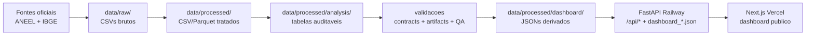
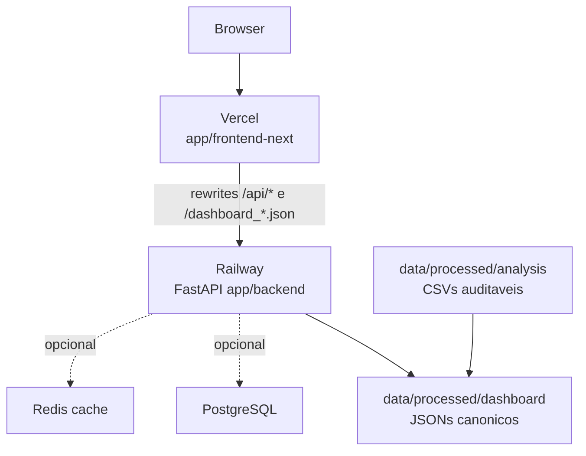

# TCC — ANEEL REN 1.000/2021

Analise setorial da eficacia da **Resolucao Normativa ANEEL no. 1.000/2021**
na qualidade comercial das distribuidoras de energia eletrica do Brasil.

O projeto mede transgressoes de prazo, compensacoes financeiras pagas na fatura
dos consumidores e normalizacao por unidades consumidoras (UCs), com recortes
por distribuidora, grupo economico, porte, territorio e periodo regulatorio.

[](https://tcc-frontend-react.vercel.app)
[](https://tcc-ren1000x414-production.up.railway.app/health)
[](requirements.txt)
[](docs/metodologia_tcc.excalidraw)

## Para Quem Chegou Agora

| Perfil | Comece por aqui | Objetivo |
|---|---|---|
| Pesquisador ou banca | [Reproducao cientifica](#reproducao-cientifica) + [evidencia primaria](#evidencia-primaria-vs-camadas-derivadas) | Conferir a cadeia de evidencias e validar os numeros. |
| Usuario do dashboard | [Demo rapida](#demo-rapida-com-dados-versionados) | Abrir o painel com os dados versionados no repo. |
| Dev frontend | `app/frontend-next/README.md` + [aplicacao local](#aplicacao-local) | Rodar o Next.js e ajustar telas/componentes. |
| Dev backend/API | `app/backend/main.py` + [arquitetura](#arquitetura-em-producao) | Entender endpoints, JSONs e degradacao Postgres/Redis. |
| Agente IA | `AGENTS.md`, `CLAUDE.md` e `.ai/` | Seguir as restricoes do projeto antes de mudar qualquer coisa. |

## Links Principais

| Ambiente | URL | Uso |
|---|---|---|
| Frontend oficial | <https://tcc-frontend-react.vercel.app> | Dashboard Next.js/React em producao. |
| Backend Railway | <https://tcc-ren1000x414-production.up.railway.app/health> | Healthcheck da API e diagnostico de dependencias. |
| Dashboard Vanilla legado | <https://analise-ren-1000-a-iv-setor-eletric.vercel.app> | Preservado apenas na branch `legacy/vanilla-dashboard`. |

## Visao Visual



### Telas Do Dashboard

| Visao geral | Ranking |
|---|---|
|  |  |

| Evolucao mensal | Mapa |
|---|---|
|  |  |

## O Que Este Repo Entrega

- Pipeline reprodutivel de dados abertos ANEEL/IBGE, de fontes oficiais ate
  tabelas analiticas validadas.
- Artefatos auditaveis em `data/processed/analysis/`, versionados para revisao
  e demonstracao.
- JSONs derivados em `data/processed/dashboard/`, consumidos pelo backend e pelo
  frontend.
- API FastAPI em `app/backend/`, publicada no Railway e resiliente a falhas
  isoladas de PostgreSQL/Redis.
- Dashboard oficial Next.js/React em `app/frontend-next/`, publicado na Vercel.
- Documentacao metodologica para o TCC em `docs/`, `.ai/` e `reports/`.

O foco exclusivo do projeto e regulacao distribuidora de energia da ANEEL,
especialmente qualidade comercial, transgressoes de prazo e compensacoes
financeiras na REN 1.000/2021.

## Demo Rapida Com Dados Versionados

Use este caminho para abrir o painel sem rebaixar os dados brutos. Ele usa os
CSVs analiticos e JSONs ja versionados no repositorio, o que serve para
explorar a aplicacao, mas nao substitui a reproducao cientifica.

```bash
make venv-recreate
make install
make doctor
make site
```

Depois abra:

```text
http://localhost:3051
```

`make site` sobe o backend em `http://localhost:8051` e o frontend Next.js em
`http://localhost:3051`.

## Reproducao Cientifica

Use este caminho para refazer a cadeia completa a partir das fontes oficiais.
Reserve pelo menos 12 GB livres e uma janela longa de execucao, pois o INDGER
tem volume grande.

```bash
make venv-recreate
make install
make doctor
make pipeline
make qa-data
make stack-next
```

O `make pipeline` executa:


```mermaid
flowchart LR
  A["Fontes oficiais<br/>ANEEL + IBGE"] --> B["data/raw/<br/>CSVs brutos"]
  B --> C["data/processed/<br/>CSV/Parquet tratados"]
  C --> D["data/processed/analysis/<br/>tabelas auditaveis"]
  D --> E["validacoes<br/>contracts + artifacts + QA"]
  E --> F["data/processed/dashboard/<br/>JSONs derivados"]
  F --> G["FastAPI Railway<br/>/api/* + dashboard_*.json"]
  G --> H["Next.js Vercel<br/>dashboard publico"]
```

Controles obrigatorios da reproducao:

- `make validate-contracts`: valida colunas, tipos, faixas e cobertura.
- `make check-artifacts-full`: confirma artefatos esperados.
- `make qa-data`: audita chaves, taxas, denominadores e cobertura temporal.
- Cobertura mensal INDGER: exatamente `2023-01` a `2025-12` nas tres tabelas
  mensais principais.

Guia canonico para baixar dados do zero, URLs CKAN, periodicidade, limites e
troubleshooting: [`docs/EXTRACAO_DADOS.md`](docs/EXTRACAO_DADOS.md).

## Evidencia Primaria Vs Camadas Derivadas

| Camada | Caminho | Papel metodologico | Versionamento |
|---|---|---|---|
| Fontes brutas | `data/raw/` | Dados oficiais baixados da ANEEL/IBGE. | Nao entra no Git por tamanho. |
| Tratamento base | `data/processed/*.{csv,parquet}` | Dados limpos, tipados e comprimidos. | Regeneravel localmente. |
| Evidencia primaria | `data/processed/analysis/` | Tabelas auditaveis usadas para interpretacao do TCC. | Versionada. |
| Auditoria textual | `reports/tcc_claims_audit.md` | Rastreia afirmacoes numericas do texto. | Versionada. |
| Camada derivada | `data/processed/dashboard/` | JSONs para comunicacao no painel. | Versionada para demo/deploy. |
| Aplicacao | `app/backend/` + `app/frontend-next/` | Exploracao e comunicacao dos dados. | Codigo versionado. |

O dashboard e a API **nao sao a fonte primaria da evidencia cientifica**. Eles
sao camadas derivadas para exploracao e comunicacao. Para auditar uma conclusao,
comece em `data/processed/analysis/` e `reports/tcc_claims_audit.md`.

## Comandos Por Objetivo

| Objetivo | Comando |
|---|---|
| Ver todos os targets | `make help` |
| Criar ambiente limpo | `make venv-recreate` |
| Instalar dependencias Python | `make install` |
| Validar ambiente | `make doctor` |
| Baixar fontes ANEEL/IBGE | `make extract` |
| Transformar raw em processed | `make transform` |
| Gerar tabelas analiticas | `make analysis` |
| Gerar relatorio e JSONs | `make dashboard-full` |
| Rodar pipeline completo | `make pipeline` |
| Validacao rapida | `make test-fast` |
| Smoke completo | `make test-smoke` |
| Auditoria numerica | `make qa-data` |
| Subir backend local | `make backend` |
| Subir frontend local | `make frontend-next` |
| Subir backend + frontend | `make site` ou `make stack-next` |
| Usar backend Railway localmente | `make site-railway` |

Use sempre `python3` ou os targets `make`. Nesta maquina, nao assuma que o
binario `python` existe.

## Aplicacao Local

Portas padrao:

| Servico | Porta | URL |
|---|---:|---|
| Backend FastAPI | `8051` | `http://localhost:8051` |
| Frontend Next.js | `3051` | `http://localhost:3051` |

Backend separado:

```bash
make backend
```

Frontend separado, usando backend local:

```bash
make frontend-next-install
make frontend-next
```

Frontend separado, usando Railway como a Vercel:

```bash
make frontend-next-railway
```

## Arquitetura Em Producao


```mermaid
flowchart TD
  Browser["Browser"] --> Vercel["Vercel<br/>app/frontend-next"]
  Vercel -->|rewrites /api/* e /dashboard_*.json| Railway["Railway<br/>FastAPI app/backend"]
  Railway --> JSON["data/processed/dashboard<br/>JSONs canonicos"]
  Railway -. opcional .-> Postgres["PostgreSQL"]
  Railway -. opcional .-> Redis["Redis cache"]
  Analysis["data/processed/analysis<br/>CSVs auditaveis"] --> JSON
```

Pontos operacionais:

- `app/frontend-next/next.config.mjs` encaminha `/api/*` e
  `/dashboard_*.json` para o Railway.
- `app/frontend-next/vercel.json` deve manter `script-src 'unsafe-inline'` na
  CSP para o boot/hydration do App Router.
- O backend deve seguir servindo JSONs mesmo com Postgres ou Redis
  indisponiveis.
- Mudancas em `app/backend/main.py` ou `data/processed/dashboard/dashboard_*.json`
  exigem redeploy do Railway.

Checklist detalhado de deploy: [`DEPLOY_CHECKLIST.md`](DEPLOY_CHECKLIST.md).

## Mapa Do Repositorio

```text
TCC_leo_main/
├── app/
│   ├── backend/              FastAPI oficial
│   └── frontend-next/        Dashboard oficial Next.js/React
├── data/
│   ├── raw/                  Dados brutos locais, nao versionados
│   ├── docs/                 PDFs/dicionarios oficiais de referencia
│   └── processed/
│       ├── analysis/         CSVs auditaveis versionados
│       └── dashboard/        JSONs canonicos para API/dashboard
├── docs/                     Documentacao tecnica e figuras metodologicas
├── reports/                  Relatorios e auditoria de afirmacoes
├── scripts/                  Validadores, QA e utilitarios
├── src/
│   ├── etl/                  Extracao e transformacao
│   └── analysis/             Tabelas analiticas, relatorio e JSONs
├── .ai/                      Contexto vivo para agentes IA
├── AGENTS.md                 Regras operacionais para agentes
├── CLAUDE.md                 Comandos, arquitetura e restricoes
└── Makefile                  Orquestracao principal
```

Os workflows e fluxos Kestra antigos foram removidos intencionalmente. O fluxo
oficial atual e Make + FastAPI/Railway + Next.js/Vercel.

## Documentacao Essencial

| Documento | Quando ler |
|---|---|
| [`CLAUDE.md`](CLAUDE.md) | Antes de desenvolver ou orientar agentes IA. |
| [`AGENTS.md`](AGENTS.md) | Antes de qualquer tarefa automatizada no repo. |
| [`.ai/CONTEXT.md`](.ai/CONTEXT.md) | Para entender fase atual, arquitetura e limites. |
| [`.ai/PIPELINE.md`](.ai/PIPELINE.md) | Para entender ETL, analise e validacoes. |
| [`docs/EXTRACAO_DADOS.md`](docs/EXTRACAO_DADOS.md) | Para baixar dados do zero ou mexer em `src/etl/`. |
| [`docs/METODOLOGIA_PIPELINE_MAKE.md`](docs/METODOLOGIA_PIPELINE_MAKE.md) | Para explicar a reproducao no texto academico. |
| [`docs/DICIONARIO_DADOS.md`](docs/DICIONARIO_DADOS.md) | Para consultar campos e significado dos dados. |
| [`docs/DATA_QUALITY_AUDIT.md`](docs/DATA_QUALITY_AUDIT.md) | Para entender backlog e contrato de qualidade. |
| [`app/frontend-next/README.md`](app/frontend-next/README.md) | Para mexer no dashboard oficial. |
| [`plano_limpeza.md`](plano_limpeza.md) | Para entender a limpeza recente do repositorio. |

## Fontes De Dados

| Fonte | Conteudo | Granularidade |
|---|---|---|
| Qualidade do Atendimento Comercial (ANEEL) | Prazos, transgressoes e compensacoes | Anual 2011-2023 por distribuidora/servico |
| INDGER — Indicadores Gerenciais (ANEEL) | Servicos comerciais mensais com volume e valor | Mensal 2023-01 a 2025-12 |
| DTB 2024 (IBGE) | Divisao territorial municipal | Municipio |

Todas as fontes usadas sao publicas. O projeto trabalha com informacao agregada
por distribuidora, servico, municipio ou grupo economico; nao ha identificador
individual de consumidor.

## Problemas Comuns

| Sintoma | Provavel causa | Acao |
|---|---|---|
| `python: command not found` | A maquina usa `python3`. | Rode via `make` ou use `python3`. |
| Backend nao sobe | Artefatos/contratos ausentes. | Rode `make validate-contracts-processed` e `make check-artifacts-full`. |
| Frontend preso em skeleton | Backend/JSON indisponivel ou CSP quebrada. | Conferir `/health` e `app/frontend-next/vercel.json`. |
| Serie mensal mostra so janeiro | Regressao na mensalidade INDGER. | Rodar `make dashboard-full`, `make check-artifacts-full` e `make qa-data`. |
| Falta dado bruto | `data/raw/` nao e versionado. | Rode `make extract` ou `make pipeline`. |

## Pesquisa Futura

O pipeline foi desenhado para ser extensivel:

- ampliar a janela temporal quando novas safras ANEEL forem publicadas;
- integrar outras bases ANEEL, como continuidade, tarifas ou perdas;
- fazer modelos econometricos em painel com efeitos por distribuidora e ano;
- comparar metodologia semelhante em outros setores regulados.

Contribuicoes sao bem-vindas, desde que preservem a rastreabilidade da cadeia de
evidencias e os contratos de dados.

## Para Agentes IA

Antes de atuar, leia `AGENTS.md`, `CLAUDE.md` e os arquivos em `.ai/`. Nao crie
backend Python fora de `app/backend/`, nao altere as portas `8051`/`3051` sem
motivo documentado e nao edite manualmente `data/processed/dashboard/*.json`.
