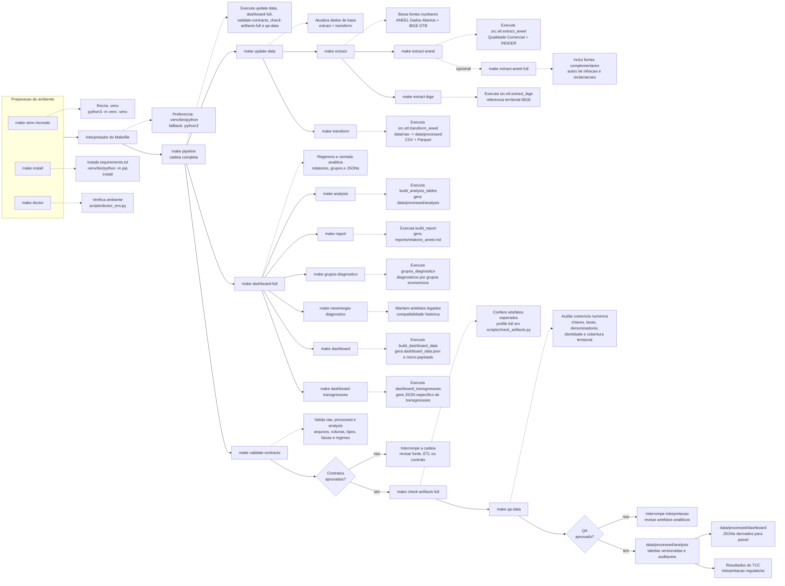

# Metodologia do Pipeline Make

Este documento explica o pipeline reprodutivel do TCC como cadeia metodologica
de evidencias. Ele serve de apoio para a secao 3.5 do texto escrito
("Validacao, rastreabilidade e reprodutibilidade") e para o fluxograma em
`Tcc_escrito/mtdpipeline.excalidraw`.

O objetivo nao e substituir o `Makefile`, mas traduzir o que cada comando faz em
termos de pesquisa: de onde o dado vem, qual script e executado, que artefato e
gerado e qual risco metodologico a etapa controla.

## Regra de Execucao

O `Makefile` usa a variavel `PYTHON` para evitar ambiguidade de ambiente:

```makefile
PYTHON_VENV := $(PROJECT_ROOT)/.venv/bin/python
PYTHON ?= $(if $(shell test -x "$(PYTHON_VENV)" && echo ok),$(PYTHON_VENV),python3)
```

Na pratica, os comandos usam primeiro `.venv/bin/python`. Se o ambiente virtual
nao existir, usam `python3`. Nao se deve pressupor o comando `python`, pois ele
pode nao existir na maquina local. Para reproduzir cientificamente o pipeline,
prepare o ambiente antes de rodar a cadeia completa:

```bash
make venv-recreate
make install
make doctor
make pipeline
```

## Fluxograma dos Comandos

O fluxograma abaixo espelha o desenho `Tcc_escrito/mtdpipeline.excalidraw`.
As setas pontilhadas para o lado explicam a funcao metodologica de cada target.



## Mapa dos Targets

| Target | O que executa | Entrada principal | Saida principal | Papel metodologico |
|---|---|---|---|---|
| `make venv-recreate` | `python3 -m venv .venv` | Python local | `.venv/` | Recria ambiente limpo para reduzir variacao local. |
| `make install` | `.venv/bin/python -m pip install -r requirements.txt` | `requirements.txt` | Dependencias instaladas | Garante bibliotecas consistentes para ETL e analise. |
| `make doctor` | `scripts/doctor_env.py` | Ambiente Python | Diagnostico do ambiente | Verifica imports e dependencias criticas antes da reproducao. |
| `make extract-aneel` | `$(PYTHON) -m src.etl.extract_aneel` | Dados Abertos ANEEL | `data/raw/*.csv` | Baixa fontes nucleares de Qualidade Comercial e INDGER. |
| `make extract-aneel-full` | `src.etl.extract_aneel --with-complementares` | Dados Abertos ANEEL | Raw nuclear + complementar | Permite baixar autos/reclamacoes, fora das metricas nucleares. |
| `make extract-ibge` | `$(PYTHON) -m src.etl.extract_ibge` | IBGE DTB | `data/raw/DTB_2024.zip` e extraidos | Integra referencia territorial e municipal. |
| `make extract` | `extract-aneel extract-ibge` | ANEEL + IBGE | `data/raw/` | Reproduz a camada bruta a partir das fontes oficiais. |
| `make transform` | `$(PYTHON) -m src.etl.transform_aneel` | `data/raw/` | `data/processed/*.{csv,parquet}` | Normaliza, tipa e comprime dados para analise. |
| `make update-data` | `extract transform` | Fontes oficiais | Dados tratados | Refaz a base bruta e processada antes da analise. |
| `make analysis` | `$(PYTHON) -m src.analysis.build_analysis_tables` | `data/processed/*.parquet` | `data/processed/analysis/*.csv` | Gera a camada auditavel principal do TCC. |
| `make report` | `$(PYTHON) -m src.analysis.build_report` | Tabelas analiticas | `reports/relatorio_aneel.md` | Produz relatorio textual derivado dos artefatos analiticos. |
| `make grupos-diagnostico` | `$(PYTHON) -m src.analysis.grupos_diagnostico` | Tabelas analiticas | `data/processed/analysis/grupos/*.csv` | Cria recortes por grupos economicos. |
| `make neoenergia-diagnostico` | `$(PYTHON) -m src.analysis.neoenergia_diagnostico` | Tabelas analiticas | `data/processed/analysis/neoenergia/*.csv` | Mantem compatibilidade com artefatos historicos. |
| `make dashboard` | `$(PYTHON) -m src.analysis.build_dashboard_data` | `data/processed/analysis/` | `data/processed/dashboard/dashboard_*.json` | Gera camada derivada para comunicacao no painel. |
| `make dashboard-transgressoes` | `$(PYTHON) -m src.analysis.dashboard_transgressoes` | Tabelas analiticas | `dashboard_transgressoes.json` | Separa payload especifico de transgressoes. |
| `make dashboard-full` | `analysis report grupos-diagnostico neoenergia-diagnostico dashboard dashboard-transgressoes` | Dados ja tratados | Analise + relatorios + JSONs | Regenera artefatos derivados sem rebaixar dados brutos. |
| `make validate-contracts` | `scripts/validate_schema_contracts.py` | Raw, processed e analysis | Falha ou OK | Detecta mudancas de schema, tipos, faixas e regimes. |
| `make check-artifacts-full` | `scripts/check_artifacts.py --profile full` | Artefatos gerados | Falha ou OK | Confirma completude dos arquivos necessarios. |
| `make qa-data` | `scripts/qa_data_audit.py` | `data/processed/analysis/` | Falha, alertas ou OK | Audita coerencia numerica, chaves, identidades e cobertura. |
| `make pipeline` | `update-data dashboard-full validate-contracts check-artifacts-full qa-data` | Fontes oficiais | Cadeia completa validada | Reproduz a pesquisa de ponta a ponta. |

## Como Usar no Texto do TCC

Ao descrever a secao 3.5, trate os comandos como controles de validade:

- `make pipeline` representa a reproducao integral da cadeia de evidencias.
- `make validate-contracts` representa a validacao estrutural.
- `make check-artifacts-full` representa a verificacao de completude.
- `make qa-data` representa a auditoria numerica e relacional.
- `data/processed/analysis/` e a camada auditavel principal.
- `data/processed/dashboard/` e camada derivada de comunicacao, nao fonte primaria.

Evite apresentar esses comandos como simples automacao. No texto academico, eles
devem aparecer como mecanismos de rastreabilidade, controle de erro e defesa
contra conclusoes baseadas em artefatos incompletos ou inconsistentes.

## Manutencao

Sempre que o `Makefile` mudar, revise:

- este documento;
- `.ai/PIPELINE.md`;
- `CLAUDE.md`;
- `README.md`;
- `AGENTS.md`;
- o desenho `Tcc_escrito/mtdpipeline.excalidraw`, quando a mudanca alterar o fluxo visual.
